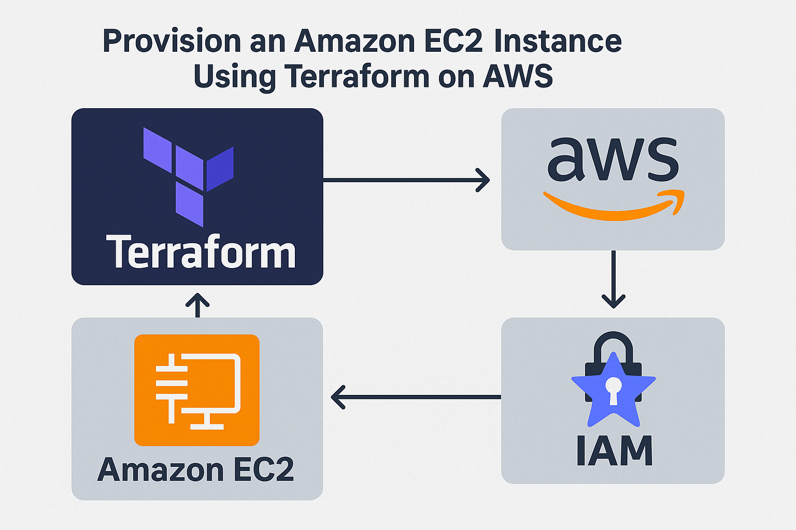

# Terraform EC2 Deployment

## Overview
This project demonstrates how to provision an Amazon EC2 instance using Terraform on AWS. It covers installation, configuration, IAM setup, and instance deployment steps.


## Features
- IAM user creation for Terraform access
- AWS CLI configuration
- Terraform installation on Windows
- EC2 instance provisioning
- State management using terraform.tfstate

## Prerequisites
- AWS account with programmatic access
- IAM user with permissions
- AWS CLI installed and configured
- Terraform installed
- Internet connection

## Steps Performed

### 1. IAM User Setup
Created an IAM user named terraform with programmatic access.

### 2. AWS CLI Configuration
Configured using:
```
aws configure
```

### 3. Terraform Installation (Windows)
Downloaded binary, placed in Program Files, added to PATH, verified via terraform -v.

### 4. Terraform Config (ec2.tf)

```bash
provider "aws" {
  region = "ap-south-1"
}

resource "aws_instance" "web-server" {
  ami           = "ami-03695d52f0d88f6s"
  instance_type = "t2.micro"

  tags = {
    name = "app-server"
  }
}
```

### 5. Deployment
```bash
terraform init
terraform apply
```

### 6. Verification
Instance app-server visible in AWS console.

.png)


## Cleanup
```bash
terraform destroy
```
